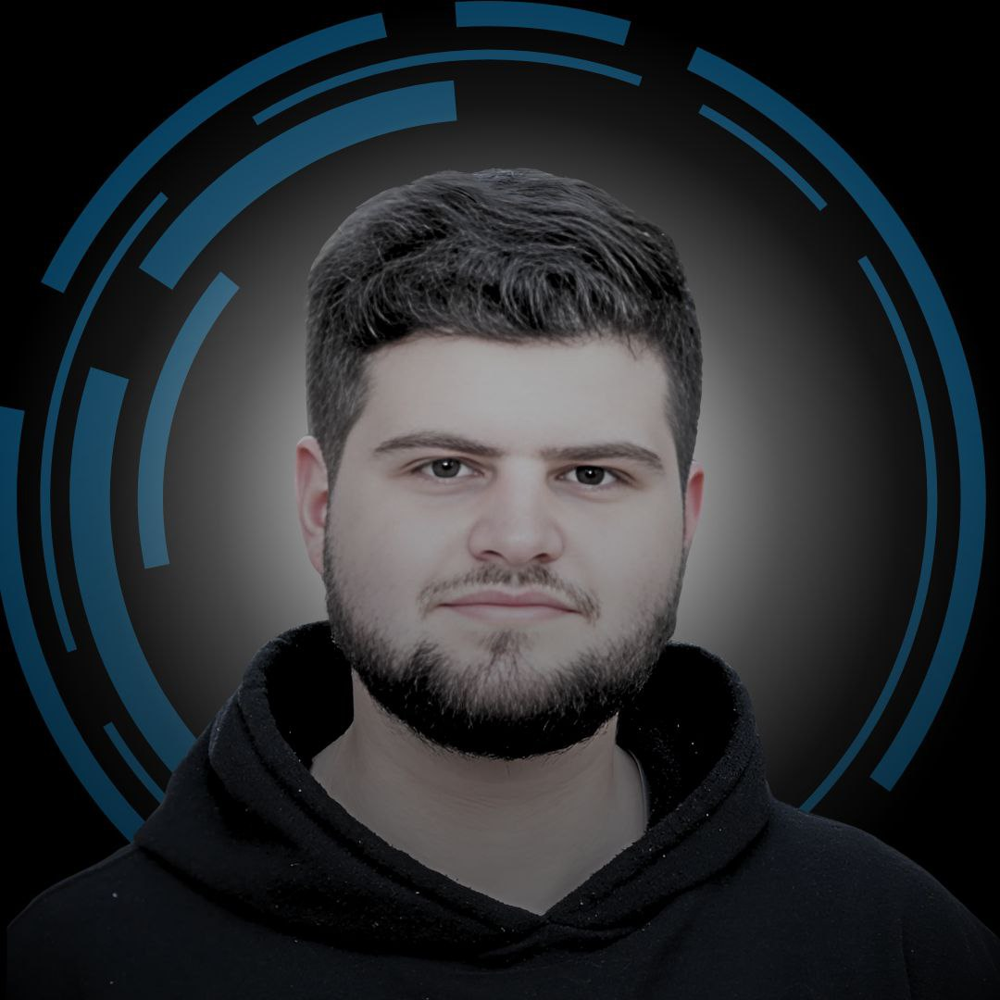

# Didar Bahaden - Web Developer Portfolio

This repository contains the source code for my personal portfolio website. It's a showcase of my front-end development skills, built with a focus on clean code, responsive design, and interactive user experiences.

**Live Demo:** [**https://didar-bahaden.vercel.app/**](https://didar-bahaden.vercel.app/)



---

## Features

-   **Fully Responsive Design:** Adapts seamlessly to all screen sizes, from mobile phones to desktops.
-   **Interactive Elements:** Features a custom project carousel, dynamic text effects, and subtle animations.
-   **Project Pages:** Includes dedicated, styled pages for my URL Shortener and Dictionary tool projects.
-   **SEO Optimized:** Includes structured data (JSON-LD) and Open Graph tags for better search engine visibility and social sharing.

---

## Technologies Used

This project is built from the ground up using core web technologies:

-   **HTML5:** For semantic and accessible content structure.
-   **CSS3:** For custom styling, animations, and responsive layouts using Flexbox and Grid.
-   **JavaScript (ES6+):** For all interactive functionality, including the carousel and API integrations for the project tools.

---

## Getting Started

To run this project locally:

1.  Clone the repository:
    ```bash
    git clone https://github.com/YOUR_USERNAME/YOUR_REPOSITORY.git
    ```
2.  Navigate to the project directory:
    ```bash
    cd YOUR_REPOSITORY
    ```
3.  Open the `index.html` file in your web browser.

---

## Contact

Have a project in mind or just want to say hello?

-   **Email:** didar.bhd@gmail.com
-   **Phone:** +964 781 784 4751